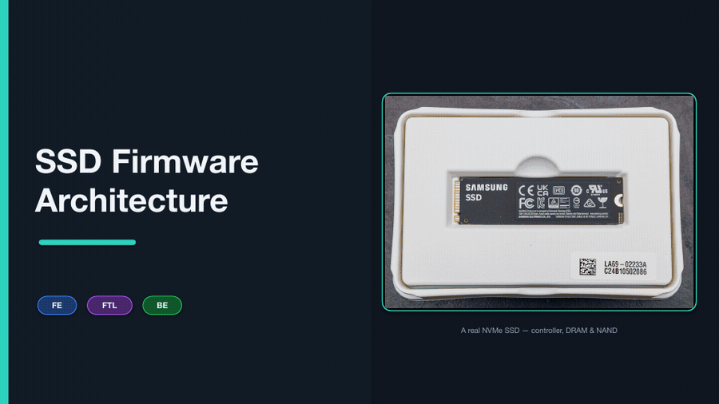

# SSD-Architecture

Clean, structured study notes **and slides** on **SSD Firmware Architecture**.

## 🎬 Slide Walkthrough

*All 32 slides play automatically above (~2.5 s each) — no click or download needed.*

## 📂 Files

| File | Description |
|------|-------------|
| [firmware-architecture-notes.md](./firmware-architecture-notes.md) | Complete notes — the three-layer **FE → FTL → BE** model and every supporting subsystem. |
| [SSD-Firmware-Architecture.pptx](./SSD-Firmware-Architecture.pptx) | Full slide deck: every notes section in order, with flowcharts, diagrams and real-world examples. |
| [SSD-Firmware-Architecture-walkthrough.gif](./SSD-Firmware-Architecture-walkthrough.gif) | Animated walkthrough of the full deck (auto-plays in this README). |

## What's inside

The notes and deck cover, clearly and section by section:

- **Why firmware exists** — NAND's three awkward properties and the log-structured fix
- **Controller hardware** — SoC block diagram (PCIe PHY, CPU cores, SRAM, DRAM, ECC, flash controller)
- **Three-layer model** — FE / FTL / BE responsibilities and interface contracts
- **Front-End (FE)** — NVMe command pipeline, SQ/CQ, PRP vs SGL, interrupts (MSI-X)
- **Flash Translation Layer (FTL)** — L2P mapping & sizing, garbage collection, wear leveling, bad-block management, TRIM, over-provisioning
- **Back-End (BE)** — NAND parallelism, LDPC ECC pipeline, read retry, program suspend/resume
- **DRAM management** — layout, mapping-table caching, write buffer, read cache
- **Multi-core firmware** — task partitioning, IPC, critical sections
- **Boot sequence** — ROM → bootloader → main FW, timing budget, secure boot
- **Firmware update** — dual-bank (A/B) mechanism
- **Power-loss recovery (SPOR)** — journaling + checkpointing, PLP
- **QoS & scheduling** — watermarks, GC throttling, tail-latency targets, VWC/FUA
- **End-to-end write path** — a 4 KB host write traced from SQE to NAND program
